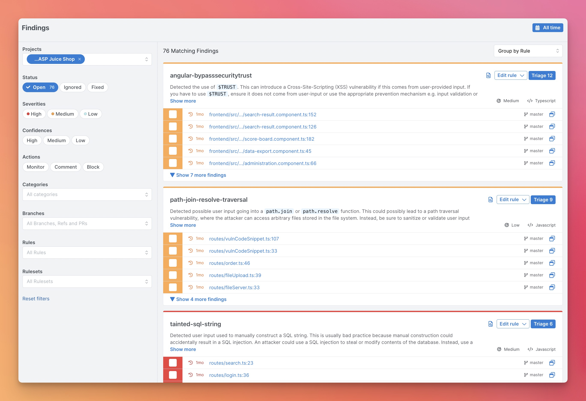
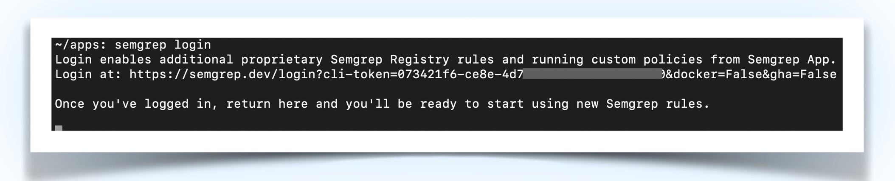
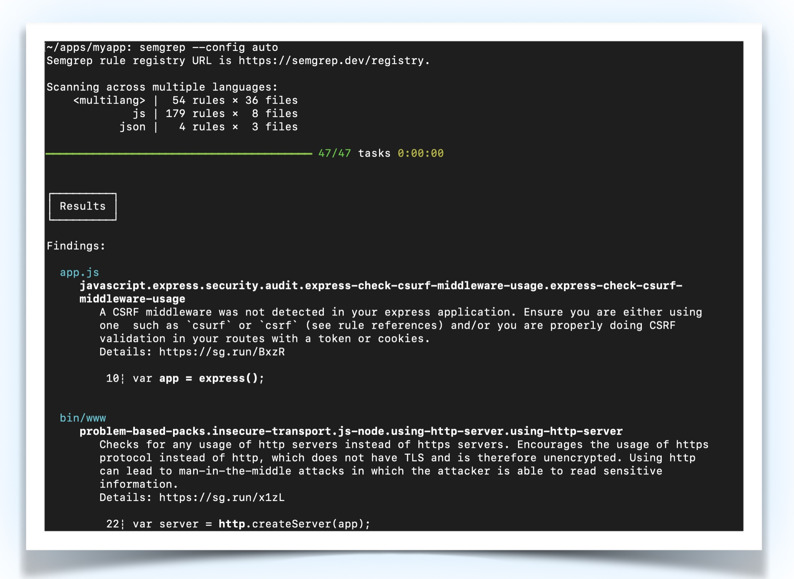
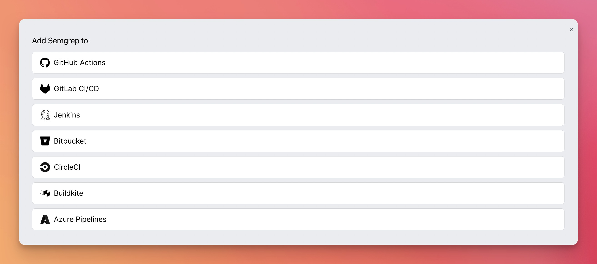

</br>
<p align="center">
    <a href="https://semgrep.dev"></a>
</p>
<h3 align="center">
  Code scanning at ludicrous speed.
  </br>
  Find bugs and reachable dependency vulnerabilities in code.
  <br />Enforce your code standards on every commit.
</h3>
<p align="center">
  <a href="https://formulae.brew.sh/formula/semgrep">
    
  </a>
  <a href="https://pypi.org/project/semgrep/">
    
  </a>
  <a href="https://semgrep.dev/docs/">
      
  </a>
  <a href="https://r2c.dev/slack">
    
  </a>
  <a href="https://github.com/returntocorp/semgrep/issues/new/choose">
    
  </a>
  <a href="https://github.com/returntocorp/semgrep#readme">
    
  </a>
  <a href="https://hub.docker.com/r/returntocorp/semgrep">
    
  </a>
  <a href="https://twitter.com/intent/follow?screen_name=semgrep">
    
  </a>
</p>
</br>

Semgrep is a fast, open-source, static analysis engine for finding bugs, detecting vulnerabilities in third-party dependencies, and enforcing code standards. [Get started →.](#getting-started)

Semgrep analyzes code locally on your computer or in your build environment: **code is never uploaded**.

Its rules look like the code you already write; no abstract syntax trees, regex wrestling, or painful DSLs. Here's a quick rule for finding Python `print()` statements. Run it online in Semgrep’s Playground by clicking the image:

<p align="center">
    <a href="https://semgrep.dev/s/ievans:print-to-logger"></a>
</p>

The Semgrep ecosystem includes the following products:

- Semgrep OSS Engine - The open-source engine at the heart of everything (this project).
- [Semgrep Cloud Platform (SCP)](https://semgrep.dev/login) - Deploy, manage, and monitor SAST and SCA at scale using Semgrep, with [free and paid tiers](https://semgrep.dev/pricing). Integrates with continuous integration (CI) providers such as GitHub, GitLab, CircleCI, and more.
- [Semgrep Code](https://semgrep.dev/products/semgrep-code) - Scan your code with Semgrep's Pro rules and Semgrep Pro Engine to find OWASP Top 10 vulnerabilities and protect against critical security risks specific to your organization. Semgrep Code provides both Community (free) and Team (paid) tiers.
- [Semgrep Supply Chain (SSC)](https://semgrep.dev/products/semgrep-supply-chain) - A high-signal dependency scanner that detects reachable vulnerabilities in open source third-party libraries and functions across the software development life cycle (SDLC). Semgrep Supply Chain is available on Team (paid) tiers.

and:

- [Semgrep Playground](https://semgrep.dev/editor) - An online interactive tool for writing and sharing rules.
- [Semgrep Registry](https://semgrep.dev/explore) - 2,000+ community-driven rules covering security, correctness, and dependency vulnerabilities.

Join hundreds of thousands of other developers and security engineers already using Semgrep at companies like GitLab, Dropbox, Slack, Figma, Shopify, HashiCorp, Snowflake, and Trail of Bits.

Semgrep is developed and commercially supported by [r2c, a software security company](https://r2c.dev).

### Language support

<h4 align="center">General availability</h4>
<p align="center">
C# · Go · Java · JavaScript · JSX · JSON · PHP · Python · Ruby · Scala · Terraform · TypeScript · TSX</br>
</p>
<h4 align="center">Beta & experimental</h4>
<p align="center">
See <a href="https://semgrep.dev/docs/supported-languages/">supported languages</a> for the complete list.
</p>

### Getting started (Recommended)

1.  Register to <a href="http://bit.ly/424Jbs0" target="_blank">semgrep.dev</a>
 


2.  Install Semgrep CLI

  ```
  # For macOS
  $ brew install semgrep

  # For Ubuntu/WSL/Linux/macOS
  $ python3 -m pip install semgrep

  # To try Semgrep without installation run via Docker
  $ docker run --rm -v "${PWD}:/src" returntocorp/semgrep semgrep
  ```

3.  Run `semgrep login` to get the login URL. Open the login URL in the browser and login.

 

4. Go to your app's root directory and run `semgrep --config auto`

 


### Getting started (CLI only)
In this flow, you'll lose the simplicity of quickly seeing and managing results and setting up CI/CD pipelines with minimal effort. Additionally, you'll be unable to use additional proprietary Semgrep Registry rules and run custom policies from the Semgrep App.

 1. Install Semgrep CLI

  ```
  # For macOS
  $ brew install semgrep

  # For Ubuntu/WSL/Linux/macOS
  $ python3 -m pip install semgrep

  # To try Semgrep without installation run via Docker
  $ docker run --rm -v "${PWD}:/src" returntocorp/semgrep semgrep
  ```

2. Go to your app's root directory and run the following:
```
semgrep --config auto
```

### Set up CI/CD in two minutes

1.  Register or login to <a href="http://bit.ly/424Jbs0" target="_blank">semgrep.dev</a>


2. Go to `Projects > Scan New Project > Run scan in CI`
 


3. Select your version control system and follow the wizard to add your project. After this setup, you'll get continuous security. Semgrep will scan your project after every pull request!


### Notes:
1.  Visit [Docs > Running rules](https://semgrep.dev/docs/running-rules/) to learn more about `auto` config and other rules. 

2. If there are any issues, please ask us at our Slack channel <a href="https://r2c.dev/slack"> https://r2c.dev/slack</a>


3. To run Semgrep Supply Chain, [contact the Semgrep team](https://semgrep.dev/contact-us).
Visit the [full documentation](https://semgrep.dev/docs/getting-started/) to learn more.

### Rule examples

Visit [Docs > Rule examples](https://semgrep.dev/docs/writing-rules/rule-ideas/) for use cases and ideas.

| Use case                          | Semgrep rule                                                                                                                                                                                                                                                                                                                                           |
| :-------------------------------- | :----------------------------------------------------------------------------------------------------------------------------------------------------------------------------------------------------------------------------------------------------------------------------------------------------------------------------------------------------- |
| Ban dangerous APIs                | [Prevent use of exec](https://semgrep.dev/s/clintgibler:no-exec)                                                                                                                                                                                                                                                                                       |
| Search routes and authentication  | [Extract Spring routes](https://semgrep.dev/s/clintgibler:spring-routes)                                                                                                                                                                                                                                                                               |
| Enforce the use secure defaults   | [Securely set Flask cookies](https://semgrep.dev/s/dlukeomalley:flask-set-cookie)                                                                                                                                                                                                                                                                      |
| Tainted data flowing into sinks   | [ExpressJS dataflow into sandbox.run](https://semgrep.dev/s/ievans:simple-taint-dataflow)                                                                                                                                                                                                                                                              |
| Enforce project best-practices    | [Use assertEqual for == checks](https://semgrep.dev/s/dlukeomalley:use-assertEqual-for-equality), [Always check subprocess calls](https://semgrep.dev/s/dlukeomalley:unchecked-subprocess-call)                                                                                                                                                        |
| Codify project-specific knowledge | [Verify transactions before making them](https://semgrep.dev/s/dlukeomalley:verify-before-make)                                                                                                                                                                                                                                                        |
| Audit security hotspots           | [Finding XSS in Apache Airflow](https://semgrep.dev/s/ievans:airflow-xss), [Hardcoded credentials](https://semgrep.dev/s/dlukeomalley:hardcoded-credentials)                                                                                                                                                                                           |
| Audit configuration files         | [Find S3 ARN uses](https://semgrep.dev/s/dlukeomalley:s3-arn-use)                                                                                                                                                                                                                                                                                      |
| Migrate from deprecated APIs      | [DES is deprecated](https://semgrep.dev/editor?registry=java.lang.security.audit.crypto.des-is-deprecated), [Deprecated Flask APIs](https://semgrep.dev/editor?registry=python.flask.maintainability.deprecated.deprecated-apis), [Deprecated Bokeh APIs](https://semgrep.dev/editor?registry=python.bokeh.maintainability.deprecated.deprecated_apis) |
| Apply automatic fixes             | [Use listenAndServeTLS](https://semgrep.dev/s/clintgibler:use-listenAndServeTLS)                                                                                                                                                                                                                                                                       |

### Extensions

Visit [Docs > Extensions](https://semgrep.dev/docs/extensions/) to learn about using Semgrep in your editor or pre-commit. When integrated into CI and configured to scan pull requests, Semgrep will only report issues introduced by that pull request; this lets you start using Semgrep without fixing or ignoring pre-existing issues!

### Documentation

Browse the full Semgrep [documentation on the website](https://semgrep.dev/docs). If you’re new to Semgrep, check out [Docs > Getting started](https://semgrep.dev/docs/getting-started/) or the [interactive tutorial](https://semgrep.dev/learn).

### Metrics

Using remote configuration from the [Registry](https://semgrep.dev/r) (like `--config=p/ci`) reports pseudonymous rule metrics to semgrep.dev.

Using configs from local files (like `--config=xyz.yml`) does **not** enable metrics.

To disable Registry rule metrics, use `--metrics=off`.

The Semgrep [privacy policy](https://semgrep.dev/docs/metrics) describes the principles that guide data-collection decisions and the breakdown of the data that are and are not collected when the metrics are enabled.

### More

- [Frequently asked questions (FAQs)](https://semgrep.dev/docs/faq/)
- [Contributing](https://semgrep.dev/docs/contributing/contributing/)
- [Build instructions for developers](INSTALL.md)
- [Ask questions in the r2c Community Slack](https://r2c.dev/slack)
- [CLI reference and exit codes](https://semgrep.dev/docs/cli-usage)
- [Semgrep YouTube channel](https://www.youtube.com/c/semgrep)
- [License (LGPL-2.1)](LICENSE)

### Upgrading

To upgrade, run the command below associated with how you installed Semgrep:

```sh
# Using Homebrew
$ brew upgrade semgrep

# Using pip
$ python3 -m pip install --upgrade semgrep

# Using Docker
$ docker pull returntocorp/semgrep:latest
```
